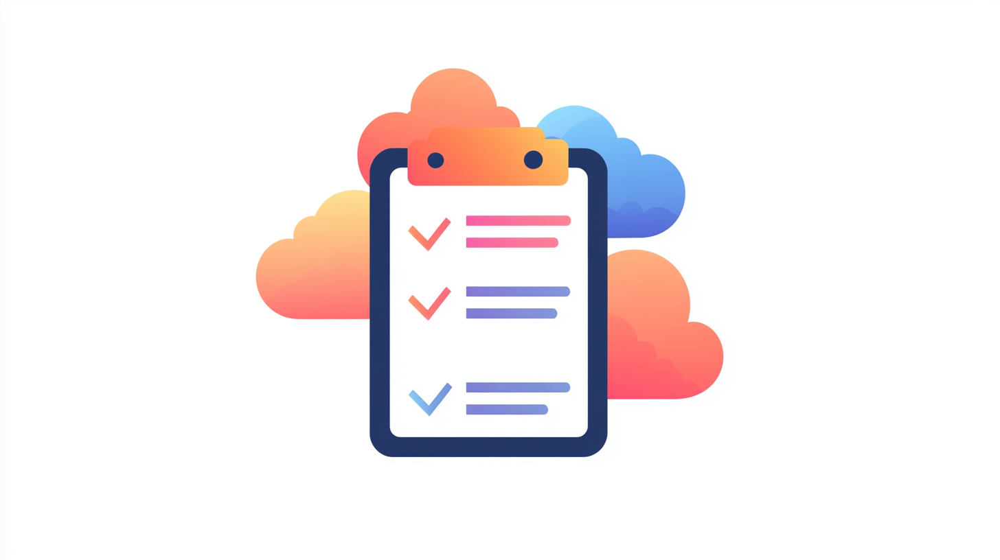

# Cloud Infrastructure Bill of Materials (Cloud IBoM)

[](https://firefly.ai)

A Framework for Cloud Infrastructure Visibility and Lifecycle Management

## Table of Contents
1. [Executive Summary](#1-executive-summary)
2. [The Challenge](#2-the-challenge)
3. [The Solution](#3-the-solution)
4. [Core Components](#4-core-components)
5. [Implementation Approach](#5-implementation-approach)
6. [Benefits](#6-benefits)
7. [Call to Action](#7-call-to-action)

## 1. Executive Summary

As organizations continue to scale their cloud infrastructure, maintaining visibility and control over the expanding technology stack becomes increasingly challenging, especially when embracing the multi-cloud strategy. While Software Bills of Materials (SBOMs) have become standard practice for application dependencies, no equivalent standard exists for cloud infrastructure components. This paper introduces the Cloud Infrastructure Bill of Materials (Cloud IBoM) - a comprehensive framework for documenting, tracking, and managing cloud infrastructure components across multi-cloud environments.

## 2. The Challenge

Organizations face several critical challenges in managing modern cloud infrastructure:

- **Visibility Gap**: No standardized way to inventory and track cloud infrastructure components across different providers and services
- **Version Management**: Difficulty in tracking and managing versions of various infrastructure components, from runtime environments to managed services
- **Lifecycle Management**: Challenge in identifying end-of-life components and planning upgrades
- **Cross-Team Communication**: Lack of common language and format for discussing infrastructure components across DevOps, Platform, and Development teams
- **Audit and Compliance**: Increasing difficulty in maintaining accurate records for audit and compliance purposes
- **Risk Analysis**: Challenge in understanding the underlying change, resulting in a possibly new behavior and unable to asses impact

## 3. The Solution

Cloud IBoM provides a standardized framework for documenting and tracking cloud infrastructure components, including:

#### Cloud Asset Management
- Compute Resources (VMs, Functions, Containers)
- Managed Services (Databases, Caches, Message Queues)
- AI/ML Services and Models
- Network Components
- Storage Resources
- Infrastructure as Code Assets

## 4. Core Components

### 4.1 Cloud Service End-of-Life (EOL) and Deprecation Management

#### Service Lifecycle Tracking
- End-of-life dates for cloud services
- Deprecation timelines and migration deadlines
- Alternative service recommendations
- Impact assessment of service transitions

#### Version Deprecation Management
- Runtime versions (Node.js, Python, Java, etc.)
- Database engine versions
- Kubernetes versions
- API versions
- SDK and library versions

#### Proactive Notifications
- Advance warning of upcoming EOL dates
- Migration timeline recommendations
- Required action items
- Risk assessment of delayed upgrades

### 4.2 Infrastructure as Code (IaC) Coverage

#### IaC Coverage Metrics
- Percentage of resources managed by IaC
- Unmanaged resource identification
- Configuration drift detection
- Template version tracking

#### IaC Health Indicators
- Template validation status
- Best practice compliance
- Security policy adherence
- Resource naming consistency

#### Stack Management
- Stack dependencies
- Module versions
- Provider versions
- State file health

### 4.3 Resource Tagging Coverage

#### Tagging Compliance
- Required tag presence
- Tag value validation
- Tag inheritance patterns
- Cross-account consistency

#### Tag Categories
- Business context (cost center, project, environment)
- Technical context (application, service, component)
- Operational context (owner, maintainer, backup policy)
- Security context (data classification, compliance requirements)

#### Tag Management
- Tag standardization
- Automated tag enforcement
- Tag cleanup recommendations
- Tag usage analytics

### 4.4 Cloud Integration Discovery and Management

#### Third-Party Integration Discovery
- CloudFormation stack scanning
- Terraform provider usage
- Custom resource definitions
- IAM role configurations

#### Integration Categories
- **Security & Compliance**
  - CSPM (Cloud Security Posture Management) Solutions
  - Identity Management
  - Secrets Management
  - Vulnerability Scanning
- **Observability & Monitoring**
  - APM Solutions
  - Log Management
  - Infrastructure Monitoring
  - Network Monitoring
- **Development & Operations**
  - CI/CD Platforms
  - Container Registries
  - Artifact Management
  - Code Quality Tools
- **Data & Analytics**
  - Data Catalogs
  - ETL Services
  - BI Platforms
  - Data Warehouses

#### Integration Health Monitoring
- Access Management
- Usage Patterns
- Compliance Status
- Performance Metrics

### 4.5 Kubernetes Estate Management

The Kubernetes ecosystem presents unique challenges in version tracking, configuration management, and operational visibility. Cloud IBoM provides comprehensive tracking of Kubernetes components across clusters and environments.

#### 4.5.1 Cluster Component Versioning

##### Core Components
- Control plane version
- kubelet version
- etcd version
- CoreDNS version
- Container runtime version
- CNI version and type
- CSI drivers and versions

Example Schema:
```json
{
  "kubernetes": {
    "clusters": [{
      "name": "prod-cluster-1",
      "provider": "EKS",
      "region": "us-west-2",
      "components": {
        "controlPlane": {
          "version": "1.27.3",
          "endOfLife": "2024-12-01",
          "upgradeAvailable": "1.28.2",
          "criticalPatches": true
        },
        "nodeGroups": [{
          "name": "app-nodes",
          "version": "1.27.3-eksbuild.1",
          "kubelet": "1.27.3",
          "containerRuntime": {
            "type": "containerd",
            "version": "1.6.18"
          }
        }],
        "networking": {
          "cniProvider": "aws-cni",
          "cniVersion": "1.12.6",
          "supportStatus": "supported"
        },
        "storage": {
          "csiDrivers": [{
            "name": "ebs.csi.aws.com",
            "version": "1.19.0",
            "status": "healthy"
          }]
        }
      }
    }]
  }
}
```

#### 4.5.2 Workload API Versions

##### API Deprecation Tracking
- Deprecated API versions in use
- Removal timelines
- Migration paths
- Impact assessment

##### Resource Versioning
- Deployments
- StatefulSets
- CRDs
- Ingress resources
- Network policies

Example Schema:
```json
{
  "apiVersions": {
    "deprecated": [{
      "resource": "Deployment",
      "currentVersion": "apps/v1",
      "deprecatedUsage": [{
        "version": "extensions/v1beta1",
        "namespace": "legacy-apps",
        "count": 5,
        "removedIn": "1.16",
        "impact": "HIGH",
        "remediation": "Migrate to apps/v1"
      }]
    }],
    "customResources": [{
      "group": "monitoring.coreos.com",
      "versions": [{
        "name": "v1",
        "served": true,
        "storage": true
      }],
      "usedIn": ["prometheus-operator"]
    }]
  }
}
```

#### 4.5.3 Add-on Management

##### Core Add-ons
- Metrics server
- Cluster autoscaler
- External DNS
- Ingress controllers
- Service mesh

##### Monitoring Stack
- Prometheus version
- Grafana version
- Alert manager version
- Logging components

Example Schema:
```json
{
  "addons": {
    "installed": [{
      "name": "aws-load-balancer-controller",
      "version": "2.5.2",
      "namespace": "kube-system",
      "status": "healthy",
      "lastUpdated": "2024-01-15",
      "configDrift": false,
      "managedBy": "helm"
    }],
    "monitoring": {
      "stack": "kube-prometheus",
      "version": "0.11.0",
      "components": [{
        "name": "prometheus",
        "version": "2.44.0",
        "status": "healthy"
      }]
    }
  }
}
```

#### 4.5.4 Configuration Management

##### Resource Configurations
- Resource quotas
- Limit ranges
- Pod security policies/standards
- Network policies
- RBAC configurations

##### Helm Chart Versioning
- Chart versions
- Value overrides
- Repository sources
- Release history

Example Schema:
```json
{
  "configuration": {
    "security": {
      "podSecurityStandards": {
        "enforcement": "restricted",
        "version": "v1.24",
        "exceptions": [{
          "namespace": "monitoring",
          "reason": "privileged prometheus requirements"
        }]
      }
    },
    "helm": {
      "releases": [{
        "name": "cert-manager",
        "namespace": "cert-manager",
        "chart": "jetstack/cert-manager",
        "version": "v1.12.3",
        "repositories": [{
          "name": "jetstack",
          "url": "https://charts.jetstack.io"
        }]
      }]
    }
  }
}
```

#### 4.5.5 Health & Compliance

##### Cluster Health Metrics
- Control plane health
- Node conditions
- Resource utilization
- Component status

##### Compliance Status
- CIS benchmark status
- Security policies
- Best practices alignment
- Audit logging status

#### 4.5.6 Implementation Guidelines

##### Discovery Process
- API server queries
- Helm list parsing
- Resource scanning
- Configuration analysis

##### Monitoring Setup
- Version tracking
- Deprecation alerts
- Health monitoring
- Compliance checking

##### Integration Points
- CI/CD systems
- Configuration management
- Security tools
- Monitoring systems

Example Implementation:
```json
{
  "implementation": {
    "discovery": {
      "methods": [
        "kubernetes-api",
        "helm-api",
        "custom-controllers"
      ],
      "frequency": "hourly",
      "retention": "90-days"
    },
    "alerts": {
      "version-mismatch": "critical",
      "deprecation-warning": "warning",
      "compliance-violation": "high"
    }
  }
}
```

## 5. Implementation Approach

### 5.1 Phased Implementation

#### Discovery Phase (1-2 months)
- Inventory existing infrastructure
- Identify key components
- Document current state
- Map integration points

#### Implementation Phase (2-3 months)
- Deploy tracking tools
- Integrate with existing systems
- Establish update processes
- Configure automated discovery

#### Optimization Phase (Ongoing)
- Analyze patterns
- Identify improvement opportunities
- Implement automated updates
- Refine processes

### 5.2 Technical Implementation

#### Data Collection
```json
{
  "collectionMethods": {
    "cloudProviderAPIs": {
      "frequency": "hourly",
      "services": ["compute", "storage", "network"]
    },
    "infrastructureScanning": {
      "frequency": "daily",
      "scope": ["IaC", "configurations", "integrations"]
    }
  }
}
```

#### Integration Framework
```json
{
  "integrationPoints": {
    "cmdb": {
      "syncFrequency": "realtime",
      "dataTypes": ["assets", "relationships", "configurations"]
    },
    "monitoring": {
      "metrics": ["health", "performance", "compliance"]
    }
  }
}
```

## 6. Benefits

### Operational Excellence
- Complete infrastructure visibility
- Proactive lifecycle management
- Simplified upgrade planning
- Better resource utilization

### Risk Management
- Early identification of end-of-life components
- Better understanding of technical debt
- Improved compliance reporting
- Enhanced disaster recovery planning

### Cost Optimization
- Identification of redundant resources
- Version consolidation opportunities
- Better capacity planning
- Reduced operational overhead

## 7. Call to Action

The Cloud IBoM initiative seeks industry participation to:
- Contribute to the specification development
- Share implementation experiences
- Develop supporting tools
- Help establish best practices